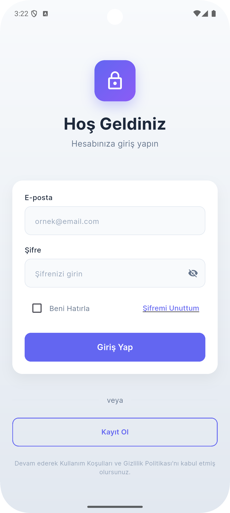
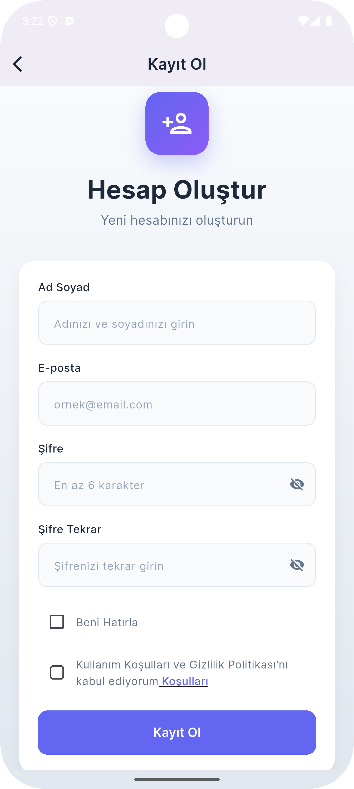
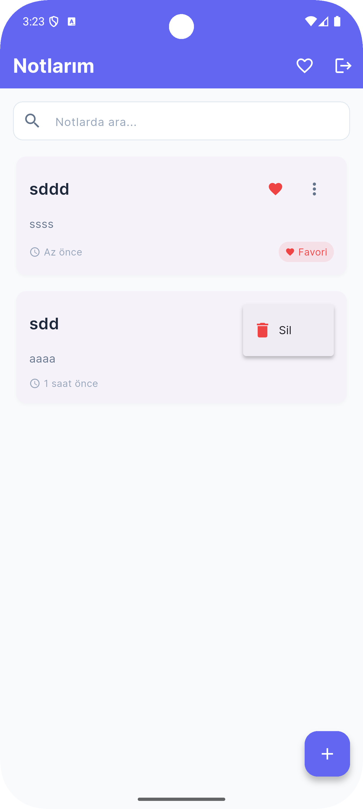
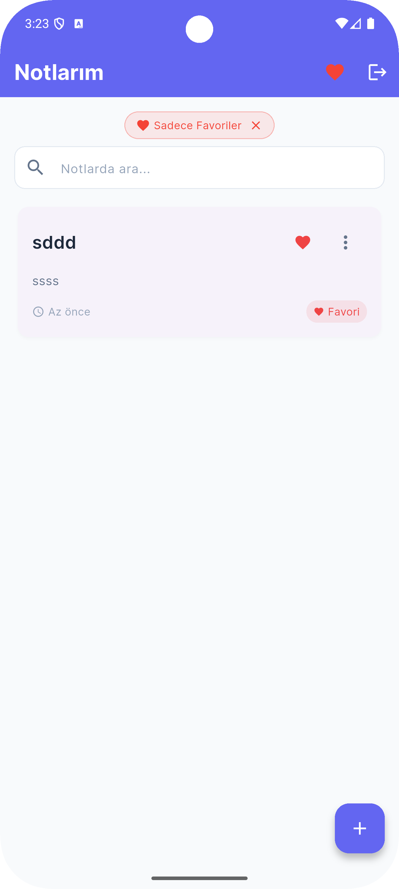
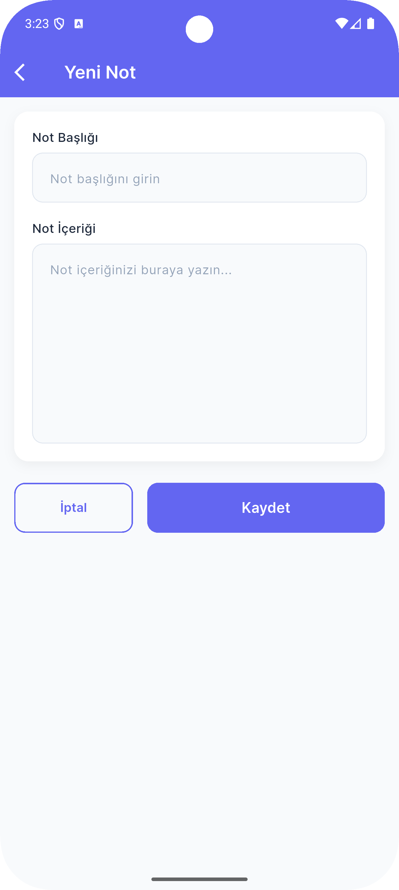

# 📝 ConnectInNote

ConnectInno için geliştirilmiş modern not alma uygulaması. Firebase tabanlı, kullanıcı dostu bir Flutter uygulaması.

## 🎯 Proje Hakkında

Bu proje, Connectinno case study kapsamında geliştirilmiş, modern bir not alma uygulamasıdır. Firebase Authentication ve Cloud Firestore kullanılarak gerçek zamanlı veri senkronizasyonu sağlanmış, GetX state management ile verimli durum yönetimi uygulanmıştır.

## ✨ Özellikler

### ✅ Tamamlanan Özellikler

#### 🔐 Kimlik Doğrulama
- Firebase Authentication ile kullanıcı kayıt
- Email/şifre ile giriş yapma
- Güvenli çıkış işlemi
- Otomatik oturum yönetimi

#### 📋 Not Yönetimi (CRUD)
- **Create**: Yeni not oluşturma
- **Read**: Notları listeleme ve detaylı görüntüleme
- **Update**: Mevcut notları düzenleme
- **Delete**: Not silme (geri alma özelliği ile)

#### 🔍 Arama ve Filtreleme
- Başlıkta arama yapma
- İçerikte arama yapma
- Gerçek zamanlı arama sonuçları
- Arama geçmişi temizleme

#### ⭐ Favori Notlar
- Notları favorilere ekleme/çıkarma
- Favori notları üstte gösterme
- Sadece favorileri listeleme filtresi
- Favori durumu senkronizasyonu

#### ↩️ Silme İşlemini Geri Alma
- Not silindiğinde snackbar ile bildirim
- "Geri Al" butonu ile anında geri yükleme
- Firestore ile otomatik senkronizasyon
- UX odaklı tasarım

#### 🎨 Kullanıcı Deneyimi
- Modern ve sade arayüz
- Material Design 3 uyumlu
- Yumuşak animasyonlar (Fade & Slide)
- Responsive tasarım
- Hata durumları için kullanıcı dostu mesajlar
- Loading state gösterimi
- Boş durum (empty state) tasarımı

### 🏗️ Mimari ve Teknolojiler

#### State Management
- **GetX**: Modern ve hafif state management çözümü
- Reactive programming
- Dependency injection
- Route management

#### Veritaşanı ve Backend
- **Firebase Authentication**: Kullanıcı kimlik doğrulama
- **Cloud Firestore**: NoSQL veritabanı ve gerçek zamanlı senkronizasyon
- **Koleksiyon Yapısı**:
  ```
  users/{userId}/notes/{noteId}
  ```
- Her kullanıcının notları izole ve güvenli

#### Veri Katmanı
- Firestore ile gerçek zamanlı veri senkronizasyonu
- Shared Preferences ile local cache (opsiyonel)
- Otomatik veri senkronizasyonu

#### UI Bileşenleri
- Google Fonts (Inter font family)
- Material Design 3
- Custom widgets:
  - `CustomButton`: Özelleştirilmiş butonlar
  - `CustomTextField`: Standart form alanları
  - `NoteCard`: Not kartı bileşeni

### 📂 Proje Yapısı

```
lib/
├── constants/          # Sabit değerler
│   ├── app_colors.dart       # Renk paleti
│   └── app_text_styles.dart  # Metin stilleri
├── controllers/        # State management (GetX)
│   ├── auth_controller.dart  # Kimlik doğrulama
│   └── note_controller.dart  # Not işlemleri
├── models/            # Veri modelleri
│   └── note.dart            # Not model sınıfı
├── screens/           # Uygulama ekranları
│   ├── add_note_screen.dart   # Not ekleme/düzenleme
│   ├── home_screen.dart       # Ana ekran (not listesi)
│   ├── login_screen.dart      # Giriş ekranı
│   └── register_screen.dart   # Kayıt ekranı
├── widgets/           # Yeniden kullanılabilir bileşenler
│   ├── custom_button.dart
│   ├── custom_text_field.dart
│   └── note_card.dart
└── main.dart          # Uygulama giriş noktası
```

### 🎨 Tasarım Özellikleri

- **Renk Paleti**: Modern ve göz yormayan renkler
- **Typography**: Google Fonts (Inter)
- **İkonlar**: Material Icons
- **Animasyonlar**: Fade ve Slide animasyonları
- **Responsive**: Farklı ekran boyutlarına uyumlu

## 🚀 Kurulum

### Gereksinimler

- Flutter SDK (>=3.9.2)
- Dart SDK
- Android Studio / Xcode (platform bazlı)
- Firebase projesi

### Adım 1: Projeyi Klonlayın

```bash
git clone <repository-url>
cd connectinnonote
```

### Adım 2: Bağımlılıkları Yükleyin

```bash
flutter pub get
```

### Adım 3: Firebase Yapılandırması

#### Android için:
1. Firebase Console'da yeni bir proje oluşturun
2. Android uygulaması ekleyin
3. `google-services.json` dosyasını `android/app/` klasörüne yerleştirin

#### iOS için:
1. Firebase Console'da iOS uygulaması ekleyin
2. `GoogleService-Info.plist` dosyasını `ios/Runner/` klasörüne yerleştirin

### Adım 4: Firebase Firestore Kuralları

Firestore Console'da aşağıdaki güvenlik kurallarını ayarlayın:

```javascript
rules_version = '2';
service cloud.firestore {
  match /databases/{database}/documents {
    // Kullanıcılar sadece kendi notlarına erişebilir
    match /users/{userId}/notes/{noteId} {
      allow read, write: if request.auth != null && request.auth.uid == userId;
    }
  }
}
```

### Adım 5: Uygulamayı Çalıştırın

```bash
# Android için
flutter run

# iOS için (macOS gerekli)
flutter run -d ios

# Belirli bir cihaz için
flutter devices
flutter run -d <device-id>
```

## 📦 Kullanılan Paketler

| Paket | Versiyon | Kullanım Amacı |
|-------|----------|----------------|
| `get` | ^4.6.6 | State management, routing, dependency injection |
| `firebase_core` | ^2.24.2 | Firebase temel yapılandırma |
| `firebase_auth` | ^4.13.0 | Kullanıcı kimlik doğrulama |
| `cloud_firestore` | ^4.13.6 | NoSQL veritabanı |
| `google_fonts` | ^6.2.1 | Özel font kullanımı |
| `shared_preferences` | ^2.2.2 | Local cache |

## 🔧 Yapılandırma

### Ortam Değişkenleri

Firebase yapılandırma dosyaları:
- `android/app/google-services.json` (Android)
- `ios/Runner/GoogleService-Info.plist` (iOS)

> **Not**: Bu dosyalar `.gitignore`'a eklenebilir, ancak bu projede örnek amaçlı dahil edilmiştir.

## 🎬 Demo Video

<p align="center">
  <video src="https://github.com/user-attachments/assets/ekranvideo.mp4" width="600" controls>
    Demo video burada görüntülenemiyor. <a href="docs/ekranvideo.mp4">Buraya tıklayarak</a> izleyebilirsiniz.
  </video>
</p>

> **Not**: Video GitHub'da görünmüyorsa [buraya tıklayarak](docs/ekranvideo.mp4) izleyebilirsiniz.

## 📱 Ekran Görüntüleri

<p align="center">
  
  
  
</p>

<p align="center">
  
  
</p>

### Temel Akışlar
1. **Kayıt Ol** → Email ve şifre ile hesap oluşturma
2. **Giriş Yap** → Mevcut hesapla giriş
3. **Not Listesi** → Tüm notları görüntüleme
4. **Not Oluştur** → Yeni not ekleme
5. **Not Düzenle** → Mevcut notu güncelleme
6. **Not Sil** → Silme ve geri alma
7. **Arama** → Notlarda arama yapma
8. **Favori** → Favori notları yönetme

## 📊 Performans

- **Firestore Optimizasyonu**: Index kullanımı ve sorgu optimizasyonu
- **Lazy Loading**: Gerektiğinde veri yükleme
- **Cache Management**: Firebase otomatik cache
- **Efficient Rebuilds**: GetX ile sadece gerekli widget'ların yeniden oluşturulması

## 🔒 Güvenlik

- Firebase Authentication ile güvenli kimlik doğrulama
- Firestore Security Rules ile veri güvenliği
- Her kullanıcı sadece kendi notlarına erişebilir
- Email verification (opsiyonel olarak eklenebilir)

## 📝 Backend API Hakkında

**Önemli Not**: Proje spesifikasyonunda FastAPI/Flask ile backend API geliştirilmesi istenmişti. Ancak, bu projede Firebase ekosistemi kullanılarak aşağıdaki nedenlerle backend API geliştirilmemiştir:

### Neden Firebase Kullanıldı?

1. **Gerçek Zamanlı Senkronizasyon**: Firestore otomatik veri senkronizasyonu sağlar
2. **Güvenlik**: Firebase Security Rules ile güçlü veri güvenliği
3. **Ölçeklenebilirlik**: Firebase otomatik ölçeklendirme
4. **Maliyet-Etkinlik**: Küçük projeler için ücretsiz tier
5. **Hız**: Backend API geliştirme süresini kısaltma

### Backend API Alternatifi

Eğer FastAPI/Flask backend gerekirse, aşağıdaki endpoint'ler geliştirilmelidir:

```
POST   /api/auth/register          # Kullanıcı kaydı
POST   /api/auth/login             # Kullanıcı girişi
POST   /api/auth/logout            # Kullanıcı çıkışı
GET    /api/notes                  # Notları listele
POST   /api/notes                  # Not oluştur
GET    /api/notes/{id}             # Not detayı
PUT    /api/notes/{id}             # Not güncelle
DELETE /api/notes/{id}             # Not sil
PATCH  /api/notes/{id}/favorite    # Favori durumunu değiştir
GET    /api/notes/search?q={query} # Not arama
```

Bu endpoint'ler Firebase Cloud Functions ile de implemente edilebilir.

## 🎯 Case Study Gereksinimleri

### ✅ Tamamlanan Gereksinimler

| Gereksinim | Durum | Açıklama |
|------------|-------|----------|
| **Authentication** | ✅ | Firebase Auth ile tam implementasyon |
| **Notes CRUD** | ✅ | Tüm CRUD operasyonları çalışıyor |
| **Search & Filter** | ✅ | Başlık ve içerik bazlı arama |
| **Pin/Favorite** | ✅ | Favori notlar üstte gösteriliyor |
| **Undo Delete** | ✅ | Snackbar ile geri alma özelliği |
| **State Management** | ✅ | GetX kullanıldı |
| **Database** | ✅ | Firebase Firestore kullanıldı |
| **User Experience** | ✅ | Modern UI, animasyonlar, error handling |

### ⚠️ Farklılıklar

| Gereksinim | Durum | Açıklama |
|------------|-------|----------|
| **Backend API** | ❌ | FastAPI/Flask yerine Firebase kullanıldı |
| **Offline-First** | 🔶 | Firebase cache var ama tam offline-first değil |
| **Bloc/Cubit** | 🔶 | GetX tercih edildi (daha modern ve hafif) |
| **AI Features** | ❌ | Zaman kısıtı nedeniyle implemente edilmedi |

### 💡 AI Özellik Önerileri (Gelecek İyileştirmeler)

1. **Akıllı Kategorilendirme**: Notları otomatik kategorize etme
2. **Otomatik Özet**: Uzun notların özetini çıkarma
3. **Akıllı Arama**: Semantik arama ile alakalı notları bulma
4. **Yazım Önerileri**: Yazım hatalarını düzeltme
5. **Etiket Önerileri**: İçeriğe göre otomatik etiket önerme
6. **Sesli Not**: Sesli notu metne çevirme
7. **Görev Çıkarma**: Nottan otomatik görev oluşturma

Bu özellikler için kullanılabilecek servisler:
- OpenAI GPT API
- Google Cloud Natural Language API
- Azure Cognitive Services

## 🧪 Test Edilmesi Gerekenler

- [ ] Kullanıcı kaydı ve girişi
- [ ] Not ekleme, düzenleme, silme
- [ ] Arama fonksiyonalitesi
- [ ] Favori işlemleri
- [ ] Geri alma özelliği
- [ ] Çoklu cihaz senkronizasyonu
- [ ] Hata durumları (ağ hatası vb.)

## 🐛 Bilinen Sorunlar

- Tam offline-first özelliği yok (Firebase cache kullanılıyor)
- Email verification zorunlu değil
- Profil fotoğrafı ekleme özelliği yok

## 🚀 Gelecek Geliştirmeler

- [ ] Tam offline-first implementasyonu (Drift/Hive ile)
- [ ] Backend API eklenmesi (FastAPI/Flask)
- [ ] AI özellikleri entegrasyonu
- [ ] Dark mode
- [ ] Notları paylaşma
- [ ] Etiket sistemi
- [ ] Not içine resim ekleme
- [ ] Rich text editor
- [ ] Sesli not kaydetme
- [ ] Çok dilli destek

## 👨‍💻 Geliştirici

Bu proje Connectinno case study kapsamında geliştirilmiştir.

## 📄 Lisans

Bu proje case study amaçlı geliştirilmiştir.

---

**Not**: Demo video ve daha detaylı resimler `/docs` klasörüne bakınız (eklenecek).
